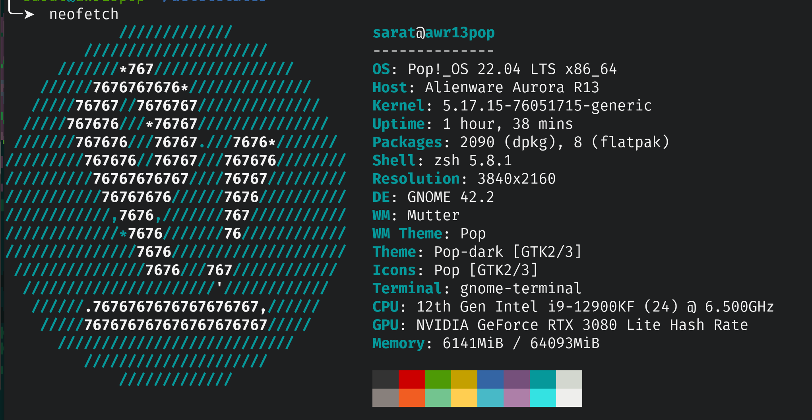

# Commands for getting system information

### Summary

_I like `neofetch`, but you have to install it first with `apt install neofetch`_



### Kernal Version

```bash
# Or just cat /proc/version
uname -r
```

### Hostname

```bash
# Or just cat /etc/hostname
hostname
```

### Current Shell

```bash
# Print the current shell
echo $0
# List all available, valid, login shells that are installed.
cat /etc/shells
# Change the current user's login shell. (This updates /etc/passwd).
# Or set zsh with /usr/bin/zsh. Either way, it must exist in /etc/shells
chsh -s /usr/bin/bash
```

### Connected Devices


```bash
# Will list all connected devices (cameras, mice)
lsusb
# Similar to lsusb, but prints tons of info about each one
usb-devices
# List all block devices (like your nvme drive, or a connected usb thumb drive)
# -p adds full path (/dev/sda), and -f adds space used and filesystem types
lsblk -pf
# List all block devices with greater detail (like storage devices only)
# Useful because it shows how each partition is formatted, and sizes
sudo fdisk -l
```

_When you plug in a thumb drive, it should be mounted at `/media/<your username>/<device name>`._

### Ram

```bash
# Shows ram usage and total ram
free -h
# Shows ram in kilobytes, but hard to read
cat /proc/meminfo
```